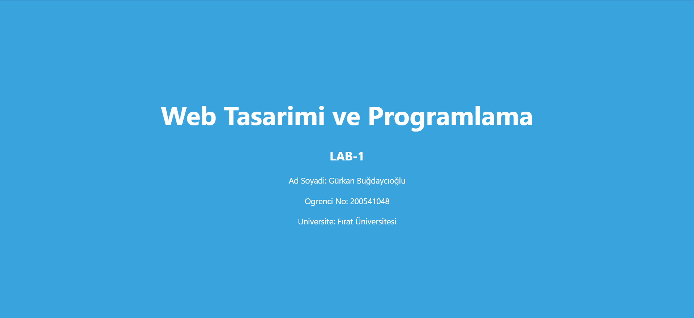

# Web LAB-1- Hello Project

## Hakkinda
Bu proje, Web Tasarimi ve Programlama dersi LAB-1 kapsaminda
Vite + React + TypeScript kullanilarak olusturulmustur.

## Gelistirici
- **Ad Soyad:** [Gürkan Buğdaycıoğlu]
- **Ogrenci No:** [200541048]

## Kullanilan Teknolojiler
- React 18
- TypeScript
- Vite

## Kurulum
```bash
npm install
```

## Calistirma
```bash
npm run dev
```

## Ekran Goruntusu


